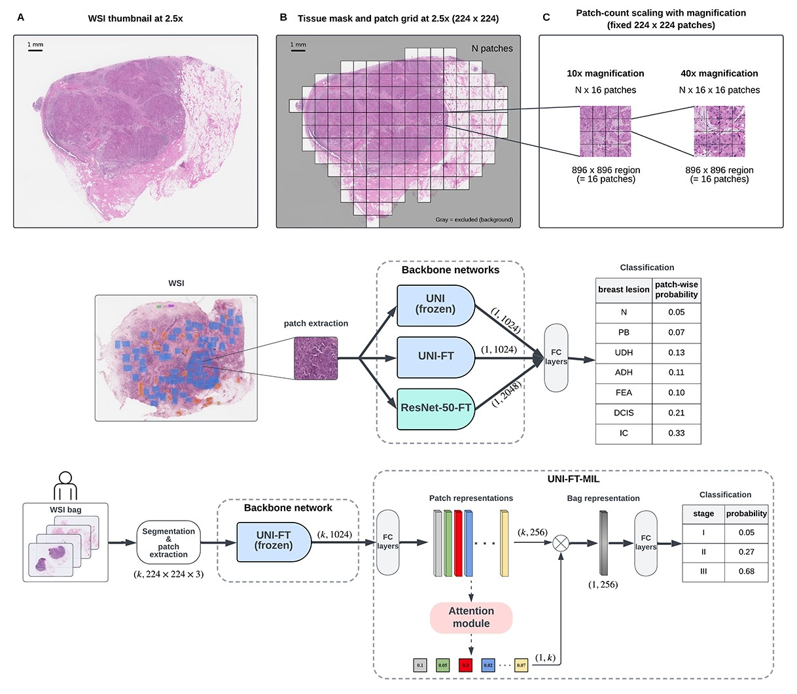

Deep-learning-based breast cancer stage prediction from H&E-stained whole-slide images in resource-constrained settings
===========


📄 **Paper**: [https://doi.org/10.1016/j.jpi.2026.100644](https://doi.org/10.1016/j.jpi.2026.100644)  

This repository accompanies our Journal of Pathology Informatics article on predicting breast cancer pathological stage (pTNM stage I–III) from low-magnification (2.5×) H&E whole-slide images (WSIs) in a resource-aware setting. The pipeline is weakly supervised: WSIs are tiled into patches, patch embeddings are extracted using a Vision Transformer (ViT) histopathology foundation model (UNI, fine-tuned on breast histology data), and patient-level predictions are produced with a multiple instance learning (MIL) aggregator.

The codebase is organized to (i) reproduce preprocessing and feature extraction, (ii) train and evaluate the MIL model, and (iii) run inference on new slides.


<div style="text-align: center;">
  
  <p style="margin-top: -10px; font-style: italic;"></p>
</div>


## Repository Structure

The repository is organized into four main sections, aligned with the datasets/cohorts used in the paper:

- **`bracs/`**: BRACS dataset utilities (backbone fine-tuning and patch-level benchmarking).
- **`semmelweis/`**: Semmelweis University cohort pipeline (training + internal validation).
- **`nightingale/`**: Nightingale cohort pipeline (external evaluation).
- **`tcga-brca/`**: TCGA-BRCA pipeline (external evaluation).


## Pipeline layout

The `bracs/` section contains the following submodules:

- `01_patch_extraction/`: Patch extraction from BRACS annotations.
- `02_backbone_finetuning/`: Fine-tuning scripts for backbone encoders on BRACS.
- `03_backbone_evaluation/`: Patch-level evaluation/benchmarking of backbone encoders.
- `conf/`: Configuration files for the respective steps.
- `cv_splits_bracs/`: BRACS split metadata used for training/validation/testing.

The `semmelweis/`, `nightingale/`, and `tcga-brca/` cohort directories follows a similar step-wise structure (some steps may be absent depending on the cohort):

- **`01_raw_patches/`** — Patch extraction and stain normalization
- **`02_patch_embeddings/`** — Patch embedding extraction using the UNI-FT encoder / patient-level WSI-bag construction utilities
- **`03_training/`** — MIL training (present only for Semmelweis)
- **`04_prediction/`** — Inference / prediction scripts
- **`05_evaluation/`** — Evaluation, metrics, and result summaries
- **`conf/`** — Configuration files for each pipeline step
- **`cv_splits_*`** — Cohort construction logic, split definitions and cohort summaries


## Data availability

- **BRACS:** Publicly available upon registration and licensed under **CC BY-NC 4.0** (see [BRACS website](https://www.bracs.icar.cnr.it/)).
- **Semmelweis:** Not publicly available due to institutional restrictions. Access for academic research may be granted upon reasonable request to the corresponding author and subject to approval by Semmelweis University.
- **Nightingale (NG):** Provided via the Nightingale Open Science program. Access is restricted to **non-commercial academic research** and requires an institutional agreement (see [Nightingale documentation](https://docs.ngsci.org/access-data)/[terms](https://docs.ngsci.org/terms-of-service) for current access and conditions).
- **TCGA-BRCA:** Publicly available via the NCI Genomic Data Commons (GDC) in accordance with TCGA/GDC data access policies.


## License

This repository’s original code is released under the **Apache License 2.0** (see `LICENSE`).

**Model/license note:** The UNI encoder (and any derived weights used in this study) is distributed under its own license terms by the original authors. Please consult the UNI repository and accompanying license for permitted uses. If you use UNI weights or code, you must comply with their licensing conditions.


## Funding

This work was supported by:

- National Research, Development and Innovation Office of Hungary — Grant No. 2020-1.1.2-PIACI-KFI-2021-00298  
- MILAB Artificial Intelligence National Laboratory — Grant No. RRF-2.3.1-21-2022-00004  
- Data-Driven Health Division of the National Laboratory for Health Security — Grant No. RRF-2.3.1-21-2022-00006  
- OTKA — Grant No. K128780  
- NIH/NCI — Grant No. R21CA286375  

## Acknowledgments

We are grateful to [Semmelweis University](https://semmelweis.hu/english/) for providing the dataset used for training and internal testing in this study.

We acknowledge [Nightingale Open Science](https://www.chicagobooth.edu/research/center-for-applied-artificial-intelligence/research/nightingale-open-science) for access to the datasets, and in particular thank Nick Foster, Josh Risley, and Senthil Nachimuthu for their continued support.

We thank the [Wigner Scientific Computational Laboratory](https://wsclab.wigner.hu/en) for providing computational infrastructure, and the [Hungarian Health Management Association](https://memt.hu/en/) for facilitating institutional access to the Nightingale dataset through its cooperation agreement with the University of Chicago.

We thank Ziad Obermeyer for his valuable feedback and insights on this manuscript.

We also acknowledge the open-source **UNI** model (Mahmood Lab) and the **BRACS** dataset for their contributions to the digital pathology community.


## Contact

For inquiries or collaborations, please contact: **Zsolt Bedőházi** (zsoltbedohazi@inf.elte.hu)


## Reference

If you use this codebase, please cite our [paper](https://doi.org/10.1016/j.jpi.2026.100644):

```bibtex
@article{BEDOHAZI2026100644,
title = {Deep-learning-based breast cancer stage prediction from H&E-stained whole-slide images in resource-constrained settings},
journal = {Journal of Pathology Informatics},
pages = {100644},
year = {2026},
issn = {2153-3539},
doi = {https://doi.org/10.1016/j.jpi.2026.100644},
url = {https://www.sciencedirect.com/science/article/pii/S2153353926001021},
author = {Zsolt Bedőházi and András Biricz and Oz Kilim and Nick Foster and Barbara Gregus and Anna-Mária Tőkés and Péter Pollner and István Csabai and Beatrice S. Knudsen},
keywords = {Breast cancer, Pathological TNM (pTNM), Whole-slide images, Digital pathology, Foundation models, Vision transformer (ViT), Multiple instance learning (MIL), Weakly supervised learning, Low magnification}
}